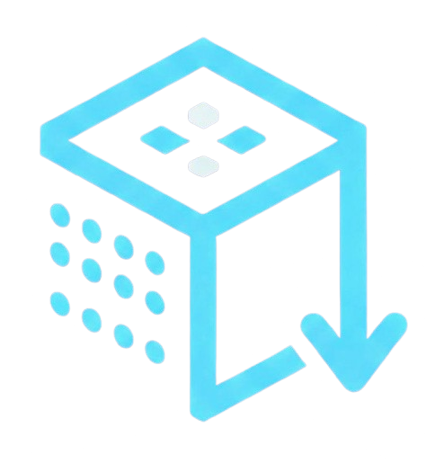

# Temporarily scale down all deployments, statefulsets, and daemonsets in a namespace



### What it does

Downscale all deployments, statefulsets, and daemonsets in a namespace to 0 
replicas and back to their previous state. Useful when you need to tear 
everything down and bring it back in a namespace.

### Install

```bash
brew tap jadolg/homebrew-tap
brew install szero
```

### Usage

#### Downscale all deployments, statefulsets, and daemonsets in a namespace to 0 replicas:

```bash
szero down -n <namespace> -n <another_namespace>
```

#### Downscale all deployments skipping statefulsets and daemonsets:

```bash
szero down --namespace <namespace> --skip-statefulsets --skip-daemonsets
```

#### Upscale all deployments, statefulsets, and daemonsets in a namespace to their previous state:

```bash
szero up -n <namespace> -n <another_namespace>
```

#### Use a different kubeconfig file

```bash
szero down -n <namespace> --kubeconfig <path_to_kubeconfig>
```

#### Use a different context

```bash
szero down -n <namespace> --context <context_name>
```

## Completions
Command line completions are available under the `completions` subcommand.
For example, to enable bash completions, run:
```bash
source <(szero completion bash)
```

## k9s plugins

Using [k9s](https://k9scli.io/)? You can use szero from within k9s as a plugin.
To install copy the contents of the **k9s-plugins.yaml** file into your plugins file.
